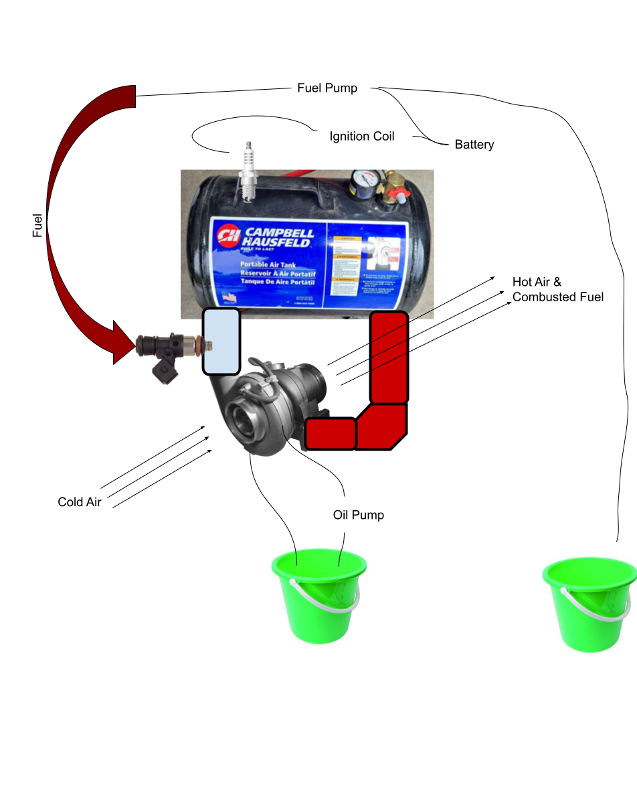

# Hook

https://github.com/carwyn987/Turbojet-Engine/assets/28845732/e915e0dc-9d34-43e3-9abc-e42c6647b102

# Turbojet-Engine

Summer of 2023, after a friend showed me videos of [turbo wood-burners](https://www.youtube.com/watch?v=6iSRcid7S44), I was captivated by the high rpms, fire, and turbo whistles. So, after a short planning period, my friend and I went to source the parts (on a budget of course).

# Quick Explanation of Concept

A turbojet engine works by the following sequential operating principles:

1. Air Intake: Air is drawn into the engine.
2. Compression: The air is compressed by the compressor blades.
3. Fuel Injection: Fuel is added to the compressed air.
4. Ignition: The mixture is ignited, producing hot gas.
5. Expansion: The hot gas expands through the turbine, generating power.
6. Exhaust: The exhaust gases exit the engine, producing thrust.

  
  

Left image [source](https://www.boldmethod.com/learn-to-fly/systems/the-4-types-of-turbine-engines/)

# Part acquisision

So, we went to Wilberts U-Pull It Auto Parts (a salvage yard) to get a fuel pump, piping for fuel (which ended up being the fuel rail), spark plugs, and .... a turbo.

We got the spark plugs from a 370z

We had to drop the engine to access the turbo, as opposed to climbing underneith the questionable structural soundness of the car.

<!-- insert engine_drop video here -->

And after a while we got it

<!-- insert we_got_the_turbo_off here -->

I bought a portable compressed air tank off facebook marketplace, and similarly, bought part of a Ford exhaust system for the tubing.

We needed to cut holes in the tank to attach the tubing. After trial and error, and eventually reading the instruction manual, we got the acetylene torch stable.

<!-- insert figuring_out_the_torch here -->

Cutting the holes had a few bumps.

<!-- insert rip_jwill here -->

Then came assembly - welding it all together, tapping some holds, etc.

A test fire to see if everything would explode.

<!-- insert test_fire here -->

And finally, a couple good runs

<!-- insert good_run here -->

<!-- insert firey_run here -->